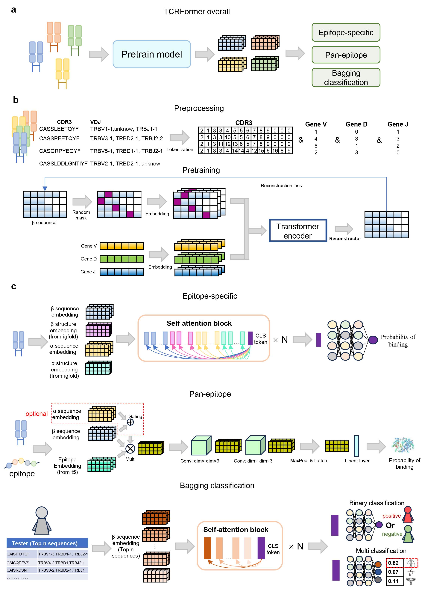

# TCRFormer
TCRFormer Learns Generalizable TCR Representations Across Epitopes and Immune Contexts


## Data Download Link


## System requirements
+ TCRFormer need enough RAM and a NVIDIA GPU to support operations
+ Python dependencies, The important packages including:
```
    python                   3.8
    torch                    1.8.0
    scikit-learn             1.1.1
    matplotlib               3.4.2    
    huggingface-hub          0.2.1
    pandas                   1.4.2
    numpy                    1.22.3
    pandas                   1.4.2
    scanpy                   1.9.1
```

## Install IgFold
### 1.Set up a suitable Python environment. 
It's recommended to use Python 3.8–3.10 and a virtual environment (e.g., venv or conda) to avoid conflicts.
```
# Using venv
python -m venv igfold-env
source igfold-env/bin/activate

# Or using conda
conda create -n igfold-env python=3.9
conda activate igfold-env
```
### 2.Install PyTorch (required)
Install PyTorch before installing igfold, based on your system and CUDA version.
For example (for CUDA 11.8):
```
pip install torch torchvision torchaudio --index-url https://download.pytorch.org/whl/cu118
```
### 3.Install igfold via pip
```
pip install igfold
```
### 4.Test the installation
After installation, run:
```
python -c "import igfold; print('IgFold is installed successfully!')"
```
## How to Use prot_t5_xl_half_uniref50-enc
There are two options to use the prot_t5_xl_half_uniref50-enc
### Option 1: Automatically Download via Hugging Face Transformers
The model and tokenizer can be automatically downloaded from Hugging Face using the transformers library. You can specify a local directory (pretrain_path) to store the model files using the cache_dir argument. you need to change the get_ep_emb function in get_ep.py.
```
from transformers import AutoTokenizer, AutoModel
import torch

def get_ep_emb(eps_data, pretrain_path='', device='cuda:1'):
    tokenizer = AutoTokenizer.from_pretrained(
        'Rostlab/prot_t5_xl_half_uniref50-enc',
        cache_dir=pretrain_path  # model files will be cached here
    )
    model = AutoModel.from_pretrained(
        'Rostlab/prot_t5_xl_half_uniref50-enc',
        cache_dir=pretrain_path
    ).to(device)
    model.eval()

```
### Option 2: Manual Download from the Website

You can manually download the model files from the official Hugging Face model page:
```
https://huggingface.co/Rostlab/prot_t5_xl_half_uniref50-enc
```
After downloading, place all files (e.g., pytorch_model.bin, config.json, tokenizer_config.json, etc.) into your local directory, e.g., /path/prot_t5_xl_half_uniref50-enc/. Then change the get_ep_emb function
```
def get_ep_emb(eps_data, pretrain_path='/path/prot_t5_xl_half_uniref50-enc/', device='cuda:1'):
```
## Obtain three types of embeddings.
### Obtain the sequence embedding from TCRFormer
Using the two functions get_betaseq_emb and get_alphaseq_emb in get_TCRseq_emb.py.
The get_betaseq_emb is used to generate TCR beta chain embeddings from a tab-separated input file containing T-cell receptor sequence and gene segment information. The function processes the sequences and gene annotations, passes them through TCRFormer, and saves the resulting embeddings to a file.
Required Inputs:
+ read_path: path to the input .tsv or .csv file containing TCR beta chain data.
+ save_path: path to save the output .npy file containing embeddings.
+ cdr3_name: column name for the CDR3β sequence (default: 'TRB_CDR3').
+ v_name, d_name, j_name: column names for the V, D, J gene segments (defaults: 'TRBV', 'TRBD', 'TRBJ').
+ delimiter: delimiter used in the input file (default: tab '\t').
+ device: CUDA device to run the model inference (default: 'cuda:0').
The function assumes that a trained model (model_with_beta.pt) and the mapping dictionaries (beta_v_dic.npy, beta_d_dic.npy, beta_j_dic.npy) already exist in ../model_save/.
Usage Example:
```
get_betaseq_emb(
    read_path='data/tcr_beta_data.tsv',
    save_path='output/beta_embeddings.npy',
    cdr3_name='TRB_CDR3',
    v_name='TRBV',
    d_name='TRBD',
    j_name='TRBJ',
    delimiter='\t',
    device='cuda:0'
)
```
The get_alphaseq_emb is used to extract TCR alpha chain embeddings from a similar structured input file. This function also reads sequences and gene segments, tokenizes and encodes them, runs them through TCRFormer, and saves the output embeddings.
Required Inputs:
+ read_path: path to the input file containing alpha chain TCR data.
+ save_path: path to save the output embeddings in .npy format.
+ cdr3_name: name of the column containing CDR3α sequences (default: 'TRA_CDR3').
+ v_name, j_name: column names for V and J genes (default: 'TRAV', 'TRAJ').
+ delimiter: file delimiter (default: tab).
+ device: CUDA device to run the model (default: 'cuda:0').
The model file model_with_alpha.pt and the mapping files alpha_v_dic.npy and alpha_j_dic.npy must be available in ../model_save/.
Usage Example:
```
get_alphaseq_emb(
    read_path='data/tcr_alpha_data.tsv',
    save_path='output/alpha_embeddings.npy',
    cdr3_name='TRA_CDR3',
    v_name='TRAV',
    j_name='TRAJ',
    delimiter='\t',
    device='cuda:0'
)
```
### Obtain the structure embedding from IgFold
Using the two functions get_betastru_emb and get_alphastru_emb in get_TCRstru_emb.py.
The get_betastru_emb generates TCR β-chain structural embeddings from input CDR3β sequences using the IgFold framework. This function predicts the 3D structural representations and saves the embeddings in a .npy file.
Required Inputs:
+ read_path: Path to a .csv or .tsv file containing CDR3β sequences.
+ save_path: Path to save the structural embedding .npy file.
+ cdr3_name: Name of the column containing CDR3β sequences (default: 'TRB_CDR3').
+ delimiter: Delimiter used in the input file (default: tab '\t').
+ padding_max_len: Maximum sequence length to pad structural embeddings (default: 30).
Usage Example:
```
get_betastru_emb(
    read_path='data/tcr_beta_data.tsv',
    save_path='output/beta_structural_embeddings.npy',
    cdr3_name='TRB_CDR3',
    delimiter='\t',
    padding_max_len=30
)
```
The get_alphastru_emb functions analogously to get_betastru_emb, but it is tailored for TCR α-chain CDR3 sequences. It generates their structure-based embeddings using IgFold and saves the results.
Required Inputs:
+ read_path: File containing α-chain CDR3 sequences.
+ save_path: Path to output the .npy file of embeddings.
+ cdr3_name: Name of the column containing CDR3α sequences (default: 'TRA_CDR3').
+ delimiter: Input file delimiter (default: tab).
+ padding_max_len: Target length for padding sequences (default: 30).
Usage Example:
```
get_alphastru_emb(
    read_path='data/tcr_alpha_data.tsv',
    save_path='output/alpha_structural_embeddings.npy',
    cdr3_name='TRA_CDR3',
    delimiter='\t',
    padding_max_len=30
)
```
### Obtain the epitope embedding from T5
Using the get_ep_emb in get_ep.py.
The function get_ep_emb is used to generate contextualized sequence embeddings for epitope peptides using a pretrained ProtT5 encoder model. 
Required Inputs:
+ eps_data: A list or NumPy array of peptide sequences (strings) representing epitopes.
+ pretrain_path: Path to the local directory containing the pretrained ProtT5 model files.
+ device: The device identifier to run the model on.
Usage Example:
```
# Assume you have a list of epitope sequences:
epitope_list = [
    "FLPSDFFPSV", 
    "LLFGYPVYV", 
    "GILGFVFTL", 
    "FLPSDFFPSV"  # repeated on purpose
]

# Path to local ProtT5 encoder model (downloaded beforehand)
model_path = "/mnt/sdb/tyh/prot_t5_xl_half_uniref50-enc/"

# Call the function
epitope_embeddings = get_ep_emb(
    eps_data=epitope_list,
    pretrain_path=model_path,
    device="cuda:0"
)

print(epitope_embeddings.shape)
# Output shape: (4, L, D) where L is the sequence length (varies) and D is the embedding dim 
```

## Pretain TCRFormer
Required Inputs:
+beta_data.npy: Encoded CDR3β amino acid sequences 
+beta_v_data.npy: V gene index labels 
+beta_d_data.npy: D gene index labels 
+beta_j_data.npy: J gene index labels 

```
model_save_path = '/data/tmp/model_with_adj_25.pt'       # Where to save the trained model
loss_save_path  = '/data/tmp/other_loss/'                # Folder to store training loss metrics

train(train_data, v_data, d_data, j_data, model_save_path, loss_save_path)
```

## Predict (downstream task)
### Pan 
```
cd downstream task/predict
python ./pan_epitope_single.py --epitope YVLTWIVGA --path /mnt/sdb/tyh/result/dier/pt/
python ./pan_epitope_single.py --epitope HWFVTQRNFYEPQII --path '/mnt/sdb/tyh/result/dier/double/pt/' --datatype singleindouble
```
### Pan (double)
```
python ./pan_epitope_double.py --epitope HWFVTQRNFYEPQII --path '/mnt/sdb/tyh/result/dier/double/pt/'
```
### MIL (binary)
```
python ./repertoire_cls_bin.py --dataname LUCA --path /mnt/sdb/tyh/result/disan/
```
### MIL (multi)
```
python ./repertoire_cls_mul.py --dataname mul_8 --path /mnt/sdb/tyh/result/disan/
```
### specific
```
python specific_epitope.py --epitope YVLTWIVGA --path /mnt/sdb/tyh/result/diyi/pt/
```

## Train (downstream task)
### Pan 
```
cd downstream task/predict/train
python pan_epitope_single_train.py --beta_train_emb_path ../../tmp_data/2/train_cdr3_emb.npy --ep_train_emb_path ../../tmp_data/2/ep_train_emb.npy --train_health_tcr_emb_path ../../tmp_data/2/health_tcr_emb.npy
```
### Pan (double)
```
python pan_epitope_double_train.py --beta_train_emb_path ../../tmp_data/3/beta_train_emb.npy --alpha_train_emb_path ../../tmp_data/3/alpha_train_emb.npy --ep_train_emb_path ../../tmp_data/3/ep_train_emb.npy --train_labels_path ../../tmp_data/3/train.csv
```
### MIL (binary)
```
python repertoire_cls_bin_train.py --train_array_path ../../tmp_data/4/train_cdr3.npy --train_labels_path ../../tmp_data/4/train_labels.npy
```
### MIL (multi)
```
python repertoire_cls_mul_train.py --train_array_path ../../tmp_data/5/train_emb.npy --train_labels_path ../../tmp_data/5/train_label.npy
```
### specific
```
python specific_epitope_train.py --beta_train_emb_path ../../tmp_data/1/beta_train_emb.npy --beta_train_st_path ../../tmp_data/1/beta_train_st.npy --alpha_train_emb_path ../../tmp_data/1/alpha_train_emb.npy --alpha_train_st_path ../../tmp_data/1/alpha_train_st.npy --train_labels_path ../../tmp_data/1/train.csv
```


