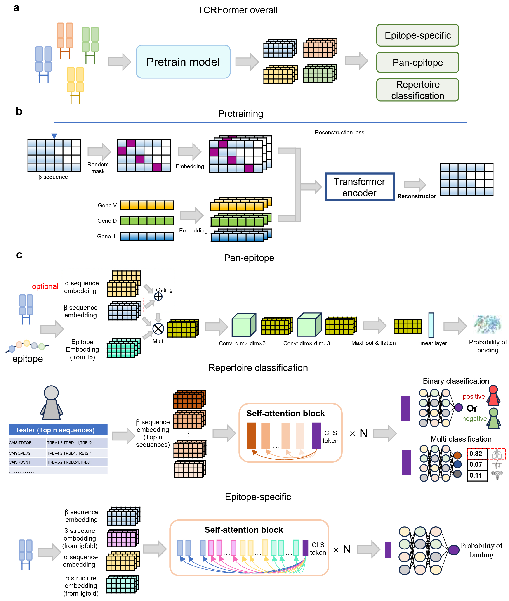

# TCRFormer
TCRFormer: a Pretrained Model with Priori knowledge for T-Cell Receptor

## Data Download Link

## Tutorial
We show how to pretrain TCRFormer in [pretrain/HowToPretrain.ipynb](./pretrain/HowToPretrain.ipynb). And You can also directly utilize the pre-trained models TCRFormer, IgFold, and T5 to extract TCR's sequence embedding, TCR's structural embedding, and epitope's embedding, respectively [get_embedding/test.ipynb](./get_embedding/test.ipynb). Once the relevant embedding have been extracted, you can proceed with downstream tasks [downstream task/predict/train/](./downstream_task/predict/train/), ultimately leading to the final prediction results[downstream task/predict/](./downstream_task/predict/).

## Requirements
To execute the code, make sure to install the required packages listed below.
* python==3.8
* torch>=1.8.0
* scikit-learn==1.1.1
* matplotlib==3.4.2
* pandas==1.4.2
* numpy==1.22.3
* scanpy==1.9.1
